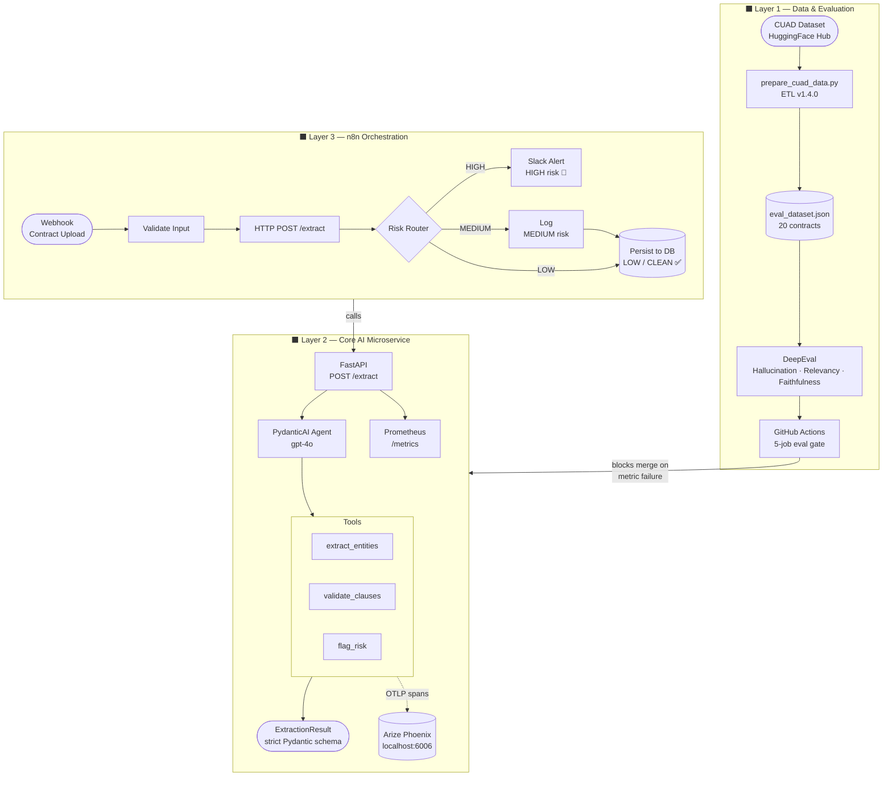

# Legal & Compliance Document Extraction Agent

An end-to-end agentic LLMOps pipeline that extracts structured legal entities and clauses from unstructured contract text into a strict Pydantic JSON schema. Built with PydanticAI and FastAPI, evaluated against the CUAD benchmark dataset, and orchestrated by n8n — it gives enterprise legal teams a production-ready microservice for automated contract review, risk classification, and clause extraction at scale.

## Architecture

The system has three fully decoupled layers (see `PROJECT_BLUEPRINT.md` for the full diagram). The **data and evaluation layer** uses the CUAD dataset as ground truth, with DeepEval enforcing zero-tolerance hallucination and strict relevancy thresholds gated in CI.

The **core AI microservice** is a FastAPI service backed by a PydanticAI agent with three deterministic tools — entity extraction, clause validation, and risk scoring — producing a fully typed `ExtractionResult` on every call, with every tool invocation traced as an OpenTelemetry span shipped to Arize Phoenix.

The **automation layer** is a 9-node n8n workflow triggered by contract uploads that calls `/extract`, routes on `overall_risk_level`, sends Slack alerts for HIGH risk contracts, and persists CLEAN contracts to a configurable persistence endpoint.



## Tech stack

| Component | Technology | Purpose |
|-----------|-----------|---------|
| AI agent | PydanticAI | Structured extraction with tool use and strict output typing |
| API | FastAPI | REST microservice exposing `/extract`, `/health`, `/metrics` |
| Evaluation | DeepEval | Hallucination, relevancy, and faithfulness metric gating |
| Observability | Arize Phoenix | OTLP trace collection and span visualization |
| Orchestration | n8n | Webhook-triggered workflow routing by risk level |
| Training data | CUAD dataset | 510 annotated contracts from HuggingFace Hub |
| Tracing | OpenTelemetry | Span emission and OTLP export to Phoenix |
| Metrics | Prometheus | Request counters and processing time histograms |
| CI/CD | GitHub Actions | 5-job eval gate blocking merges on metric failure |

## Quick start (local development)

### Prerequisites

- Python 3.11+ (conda or venv recommended)
- OpenAI API key
- Git

### Installation

```bash
pip install -e ".[dev]"
cp .env.example .env
# Edit .env with your OPENAI_API_KEY
```

### Run the API server

```bash
uvicorn legal_agent.api.main:app --reload
# API docs at http://localhost:8000/docs
# Metrics  at http://localhost:8000/metrics
```

### Run Arize Phoenix (observability UI)

```bash
python -m phoenix.server.main serve
# UI at http://localhost:6006
```

## Running evaluations

### Fast tests (no LLM, no API key needed)

```bash
pytest evaluation/ -m "not llm" -v
# 33 tests, ~12 seconds
```

### Integration tests (no LLM)

```bash
pytest evaluation/ -m integration -v
# 23 tests, ~12 seconds
```

### Full eval suite (requires OPENAI_API_KEY)

```bash
pytest evaluation/ -m llm -v
# 14 tests, ~15 minutes, costs ~$0.50–1.00
```

## Docker deployment

### Start the full stack

```bash
docker compose up --build
```

Services start in dependency order: Phoenix → Legal Agent → n8n.

### Services

| Service | URL | Description |
|---------|-----|-------------|
| Legal Agent API | http://localhost:8000 | FastAPI extraction service |
| API Docs | http://localhost:8000/docs | Swagger UI |
| Metrics | http://localhost:8000/metrics | Prometheus metrics |
| Arize Phoenix | http://localhost:6006 | Trace observability UI |
| n8n | http://localhost:5678 | Workflow orchestration |

### Environment variables

Copy `.env.example` to `.env` and fill in required values:

| Variable | Required | Description |
|----------|----------|-------------|
| `OPENAI_API_KEY` | Yes | OpenAI API key used by the PydanticAI agent for all LLM calls |
| `PHOENIX_API_KEY` | Yes | Arize Phoenix API key; use `local` when running Phoenix locally |
| `PHOENIX_COLLECTOR_ENDPOINT` | Yes | OTLP collector URL, e.g. `http://localhost:6006/v1/traces` |
| `N8N_BASIC_AUTH_USER` | No | n8n web UI login username (default: `admin`) |
| `N8N_BASIC_AUTH_PASSWORD` | No | n8n web UI login password — change before network exposure |
| `DATABASE_API_URL` | No | Base URL for the contract persistence API called by the n8n workflow |

## CI/CD pipeline

GitHub Actions runs five jobs in sequence on every push and pull request to `main`:

```
lint-and-type-check → unit-tests → integration-tests → eval-gate → build-and-push
```

`eval-gate` enforces four hard thresholds using DeepEval with live LLM calls.
All merges are blocked if any threshold is missed:

| Metric | Threshold |
|--------|-----------|
| HallucinationMetric | 0.0 — zero tolerance on legal entities |
| AnswerRelevancyMetric | ≥ 0.75 |
| FaithfulnessMetric | ≥ 0.90 |
| Schema pass rate | 100% — every response must parse into `ExtractionResult` |

## Project structure

```
legal-contract-extraction-agent/
├── Dockerfile                        # Multi-stage build, non-root user
├── docker-compose.yml                # legal-agent + Phoenix + n8n stack
├── .dockerignore
├── pyproject.toml
├── .env.example
├── src/legal_agent/
│   ├── schemas/                      # Pydantic models — no logic
│   ├── services/                     # Pure deterministic Python
│   ├── agent/                        # PydanticAI agent, tools, runner, prompts
│   ├── api/                          # FastAPI app, routers, request/response models
│   └── observability/                # Arize Phoenix + OpenTelemetry setup
├── evaluation/
│   ├── golden_dataset/               # CUAD-derived JSONL ground truth
│   └── tests/                        # pytest + DeepEval test suites
├── scripts/
│   └── prepare_cuad_data.py          # ETL: CUAD → data/eval_dataset.json
├── data/
│   └── eval_dataset.json             # Runtime only — gitignored
├── n8n/
│   ├── contract_extraction_workflow.json
│   └── README.md
└── .github/workflows/
    └── eval-ci.yml
```

## Dependency pins

| Package | Pin | Reason |
|---------|-----|--------|
| `datasets` | `==2.14.6` | `theatticusproject/cuad-qa` requires the legacy script-based loader removed in 2.15 |
| `pyarrow` | `>=12.0.0,<14.0.0` | pyarrow 14 removed `PyExtensionType`, breaking the CUAD dataset loader |
| `numpy` | `>=1.24.0,<2.0.0` | numpy 2.0 removed `numpy.core.multiarray`, required by the pinned pyarrow range |

All three pins can be removed together when the CUAD dataset migrates to Parquet format.

## Sprint history

| Sprint | Deliverable | Key metric |
|--------|-------------|------------|
| 1 | CUAD ETL pipeline — `prepare_cuad_data.py` v1.4.0 | 510 contracts → `eval_dataset.json` |
| 2 | Pydantic schemas + FastAPI endpoints + PydanticAI agent | `ExtractionResult` strict schema, 4 API endpoints |
| 3 | DeepEval eval suite wired to live agent | 14 LLM tests, hallucination / relevancy / faithfulness |
| 4 | Arize Phoenix + Prometheus observability | 14 integration tests, mypy clean on 14 source files |
| 5 | 9-node n8n pipeline + e2e tests + CI hardening | 23 integration tests, 33 not-llm tests, 5-job CI gate |
| 6 | Docker multi-stage build + compose + production README | Non-root container, 3-service compose stack |
